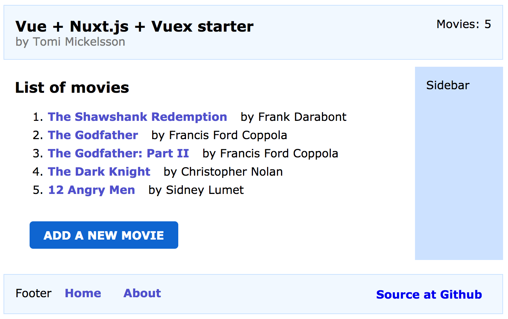

This is my minimal yet functional Vue starter kit and demo app as of
August 2018.

If you feel tired of Javascript fatigue, and want to get started quick and
easy, take a peek of this.  Developing a modern Vue app does not get
much simpler than this.


LIVE DEMO [nuxtjs.tomicloud.com](https://nuxtjs.tomicloud.com)
--------------------------------------------------------------



The demo app is a static site, a basic single-page-app that has a few
addressable pages that are lazy loaded on-demand. It demonstrates basic CRUD
operations: 1) list movies, 2) view movie details, 3) create/edit and 4)
delete a movie.

The demo uses browser localStorage for the data storage, which means it runs
without a backend.  The sources do contain a module that does real AJAX calls
to a REST backend - you just need to enable the module and write a server, and
you are in good track to have a real web app. I have developed
[RESTPie3 Python REST API server](https://github.com/tomimick/restpie3) which
implements this simple movie API as an example.


Building blocks
---------------

The demo app consists of a simple but powerful tech stack that provides the
essential functionality for creating modern web apps. It stands on the
shoulders of a few great libraries:

* [Vue](https://vuejs.org/) is a practical and elegant Javascript library for
  modern web dev
* [Nuxtjs](https://nuxtjs.org/) is a lightweight Javascript framework that
  provides structure and basic core functionality for Vue apps
* [Vuex](https://vuex.vuejs.org/) is a quick and easy state management library
  that Nuxtjs supports natively
* [SASS](https://sass-lang.com/) is the good old CSS extension language that
  still does the job fine
* [Axios](https://github.com/axios/axios) is a popular AJAX library based on
  Promises

Source tree
-----------

```
├── /assets/                    # assets to be processed by Nuxt
│   └── /layout.sass              # main layout of site
├── /components/                # vue components used by pages
│   └── /myheader.vue             # site header component
├── /layouts/                   # page top-level layouts
│   └── /default.vue              # main site layout
├── /pages/                     # pages
│   ├── /about.vue                # about page
│   ├── /index.vue                # home page, lists movies
│   ├── /moviedetails.vue         # details page, views a movie
│   └── /movieedit.vue            # edit page, edits a movie
├── /static/                    # static assets, accessed/exported as is
│   ├── /favicon.ico              # favicon
│   └── /exampledata/
│       └── /movies.json          # sample list of 4 movies - loaded initially
├── /store/                     # data stores managed by Vuex
│   └── /index.js                 # the single store for this app
├── config.js                   # app config, select ajax or localstorage
├── nuxt.config.js              # nuxtjs config
├── package-lock.json           # npm something
├── package.json                # list of npm packages required
├── README.md                   # this doc
├── serverapi_ajax.js           # API, talks AJAX to a real backend
└── serverapi_localstorage.js   # API, talks to localStorage
```

Local development
-----------------

Here's how to run the starter in your local machine:

```bash
$ git clone https://github.com/tomimick/tm-nuxtjs-starter
$ cd tm-nuxtjs-starter
$ npm install
$ npm run dev
```

Then point your browser to http://localhost:3000.

When any of the dependant files is modified, the changes are hot loaded and
become visible instantly. Enjoy the dev!


Nuxt.js
-------

[Nuxtjs](https://nuxtjs.org/) is a great little framework that brings
structure and core SPA functionality to Vue-based apps. It makes it easy to
start the app development, letting you focus on your core app, but also
provides practices to guide you in creating a more complicated app.

Nuxt.js benefits in a nutshell:

* Minimum configuration - no need to tinker with webpack or babel configs,
  unless you want
* Enforces structure to the source files - guidance for crafting apps in
  a logical and documented manner
* Hot reloading of pages to speedup the dev work
* Built-in SPA routing logic
* Automatic code splitting of pages, transpiling of js
* Deployment options: export a static server-less site or run Node.js in the
  backend

Nuxt.js takes advantage of Vue's [Single File Components](https://vuejs.org/v2/guide/single-file-components.html)
which is an excellent practical solution to encapsulate the template, logic
and styling of a Vue component together in the same source file.

Nuxt.js is directly inspired by [Nextjs](https://nextjs.org/) which is the
same framework for the React ecosystem. Nuxt.js introduces a little more
hierarchy, having folders for layouts, plugins, and middleware.

This starter uses the nuxt-edge package, which is the upcoming Nuxt version 2
that relies on the latest, greatest Webpack 4.


Vuex state management
---------------------

Since Nuxtjs has the tooling to support developing an app with lots of data
and code, one usually needs some kind of state management solution for sharing
data across pages and components.

Nuxtjs natively integrates with [Vuex](https://vuex.vuejs.org/) state
management library. This is a well crafted library which is authored by Evan
You, the same talented guy who created Vue. Vuex is simple enough to learn
quickly. You construct your store from state data, and mutations and action
functions.

To activate vuex, you just drop a store component in the store/ folder, where
Nuxt picks it up from and makes it available as ```this.$store``` in all Vue
page components.  That is all to it, no further configuration is required.

It is also possible to use other state libraries like
[MobX](https://mobx.js.org/) but because of the built-in integration, Vuex is
a natural choice with Nuxtjs.


Generating a static site
------------------------

The ability to generate a static site with Nuxtjs is an important tool which
makes it possible to run apps without a backend server. You can export the
site to [GitHub pages](https://pages.github.com/),
[Netlify](http://netlify.com) or Amazon S3. (But check a few gotchas with
site+link prefixes with Github pages.)

Another win of static generation is to be able to hook up the app with any
REST backend no matter what is the language of the backend. Clean separation of
frontend and backend also provides modularization at tech level and possibly
at team level.

To generate a static site, simply run

```bash
$ npm run export
```

And the static files will be generated in the ```dist```-folder.

To test the static site locally via a local www-server, I quickly run a
python script: (python3 -m http.server)

```bash
$ npm run pyserve
```

And then test the site at http://localhost:8000.

### Size of Javascript

Nuxtjs performs well, generating a home page whose size is **only about 69KB
minified and gzipped**. This is a good result out of the box.

The browser loads the home page with a total of 4 requests, and each new page
that is loaded on-demand makes a single js request *once*.

```bash
Page Size Inspector Report
URL: https://nuxtjs.tomicloud.com/

REQUEST                                       REQ     BYTES

TOTAL___________________________________________4____68,802

Document________________________________________1_______960
-nuxtjs.tomicloud.com/                                  960

Script__________________________________________3____67,842
-nuxtjs.tomicloud.com/_.../0b088016842f5f4f735       53,552
-nuxtjs.tomicloud.com/_.../1c78d24f170a4f6d1ea       13,680
-nuxtjs.tomicloud.com/_.../f17a22e19f8ece7f59c          610
```

(Report by my Chrome extension [Page Size Inspector](https://chrome.google.com/webstore/detail/oepnndnpjiahgkljgbohnnccmokgcoln).)


Vue vs React - my opinion
-------------------------

Vue and React are both really good choices for modern web dev: they are based
on modern reactive/virtual DOM concept, they are lightweight and hugely
popular with big ecosystems. A developer can't always choose between these
two, but if one can, in the end it maybe a matter of taste which one a
developer considers better. The taste decision usually comes down to a
philosophy of whether you like JSX or templates.

If I can choose my weapon for a front-end project, I would choose Vue. The
primary reason for me is code readability and personal productivity. I can
read and write HTML templates with Javascript ASIDE more easily than JSX.
Long JSX runs can be dizzying and somewhat noisy.  A template decorated with
just a few directives just feels more readable to me. I like to see the HTML
building blocks first in the line, not JSX map()-functions or ternary
operators or short-circuits.  I suppose templates feel more natural to me
because of my history of working with the 3 elementary building blocks of the
web, HTML, JS, and CSS, long before the Javascript overlord took over the
world.

I highly appreciate the separation of 3 concerns that is practiced in Vue
[Single File
Components](https://vuejs.org/v2/guide/single-file-components.html).  I guess
I represent the old school thinking which says that the view, logic and
styling should have some separation between them and should not be mixed
all-together.  They DO have coupling between them, that is a natural thing,
and they should be located NEAR each other, preferably in the same source
file, but not intermixed.  Too tight coupling may end up in spaghetti.

However, I also understand the opposing views which state that React is better
over Vue, and which argue that another template DSL is the weaker approach. If
you come from a Javascript background, React may feel more natural for you. I
can work with both choices (I even made these 2 starter kits!) but maybe Vue
has a slight edge for me.

If you want to read about one of the recent decent Vue vs React debates, check
this [Reddit
thread](https://www.reddit.com/r/javascript/comments/8o781t/vuejs_or_react_which_you_would_chose_and_why/).


Need help?
----------

Go ahead and take this Vue starter and perhaps my [RESTPie3 Python REST API
server](https://github.com/tomimick/restpie3) too and build your great
service.

You can also [contact me](mailto:tomi.mickelsson@gmail.com) to ask if I am
available for freelancing work.


React version
-------------

If you prefer React over Vue, I have also coded this same starter with
[React Nextjs](https://github.com/tomimick/tm-nextjs-starter).

License
-------
MIT License

